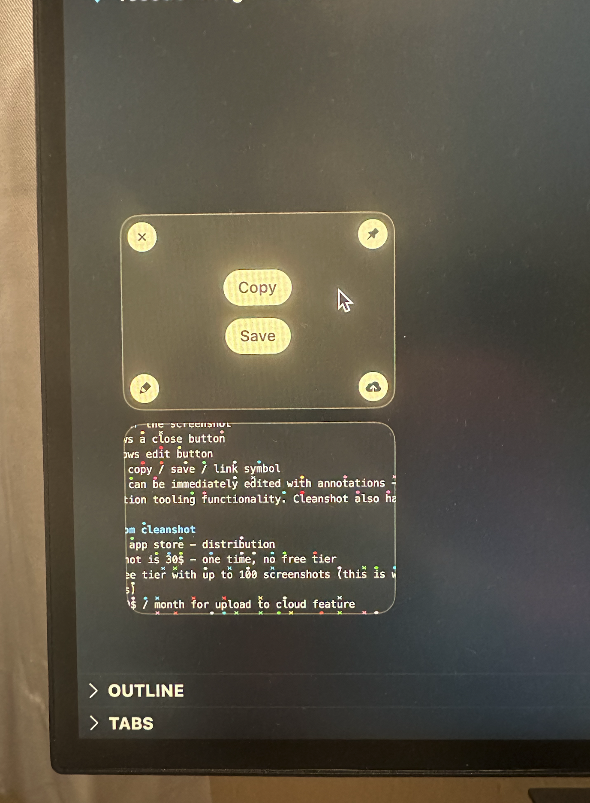

# Share Shot

Screenshoting app for macOS. Prototype. 
SwiftUI, basic English and basic coding skills required.

This project implements extended screenshot functionality of native macOS screenshoting (try Shift+Cmd+4). We are trying to compete with clean shot X https://youtu.be/FZbICrBKWIU. To understand how hard it is to compete we are implementing a proof of concept with the main features from their product. I have already put together the basic infrastructure to implement the desired functionality.

Most tasks in the project will be:
- Pretty standard UI development using SwiftUI
- Using screen capture APIs I have pre-researched
- Some macOS window magic (which I think I have figured out already, so you don't have to figure it out, just use the existing approach)

# TODO
- Currently there is a semi-transparent cross on the screen that remains in the same position where the mouse was when starting the app, while the actual cross moves around
- Stack of captures does not appear if the app is invoked with a keyboard shortcut (Shift + Cmd + 7), which is how the app should appear in the first place, us entering capture mode by default is simply for debugging purposes
- Currently if you hover over the screenshot in the stack, the buttons appear but not always disappear as the mouse leaves the area
- More window magic needed (a good starting point is the current panel windows that we use)
  - If I click anywhere outside of the stack, the stack should remain visible. This is the current behavior of cleanshot, ant is very convenient when you don't want to lose the stack of screenshots you have taken
  - When running xcode in full screen mode
    - [With an additional monitor] The screenshot area (blue) appears on a different screen that Xcode is running on
    - [With a single screen] The fullscreen space gets switched from to a desktop space, and only then the blue area appears
- Cleanup example code from the original capture project by apple
- Release on the app store

# Detailed functionality and implementation notes

## Upon startup
- [library added, user not prompted though] Prompt user to launch at login (startup item)
- [done] Add a keybinding to (Shift + Cmd + 7) to start selecting an area for screenshot
- [Later] Remove stock keybindings for screenshoting on macOS in settings
  - How to find the settings
  - https://share.cleanshot.com/y0jMlvfP
  - https://share.cleanshot.com/ynnnL0mm

## When user uses the keyboard shortcut
- [Done] We present an invisible window over the entire screen, hide the mouse an show a selection rectangle
  - If the user clicks escape - we dismiss the window and do nothing
  - Once the area is selected - we just kind of show the area and thats it
- [Task-1] We take the screenshot of the selected area and show it in the bottom left corner of the screen
  - Originally the project I started with was this tutorial by apple on how to use screen capture api https://developer.apple.com/documentation/screencapturekit/capturing_screen_content_in_macos
  - Most of the code from that is in this project, just inactive under /SampleCodeFromCaptureExample
  - You most likely will use this API to capture a screenshot: https://developer.apple.com/documentation/screencapturekit/scscreenshotmanager
  - You might run into some issues with coordinate systems in swiftui vs appkit, not matching - use ChatGPT + google + talk to me if you run into issues. There is a function `convertToSwiftUICoordinates` that deals with the issue.
  - To start off - just add the single screeshot to the same window - bottom left corner. Escape will dismiss similarly.

## Window behavior
The rule of thumb:
- we should not interfere with anything that the user is doing
- the screenshot stack should stay visible until the user explicitly dismisses it
- the ideal experience is clean shot - our differentiation from them will be in the shortcuts, and probably making this open source

- The screen / space should not switch due to us taking the screenshot.
- The screen we are taking a picture of (where the blue are window appears) should follow the mouse. Alternatively we can place the area on every single screen, we should think about which one is easier to implement. Basically if I invoke the shortcut while one screen is in focus, I should be able to move to another screen and take a screenshot there
- When we move the mouse to a different screen, the screenshot stack should follow 

## Stack of Screenshot Cards
How it looks like: 

- Have a sticky stack of screenshots on the left bottom that stays there until explicitly dismissed by the user, see examples of cleanshot
  - The difficult thing here is to make it sticky, but not take focus from other applications. I think we can use the same exact approach as we do with the window for screenshot selection. We can just create a similar window to that one with roughly the same configurations, but only show on the left column of the screen. The windows will never be active at the same time.
  - As you take more screenshots, they should be pushed on top of the stack
  - Restore mouse pointer
  - Make sure its on a different window - we don't want to keep blocking the user's view
<<<<<<< HEAD
=======
- You can drag the screenshot to drop it into another applications like telegram, gmail, etc.
>>>>>>> main
- As you hover the mouse over the screenshot in the stack
  - Top left shows a close button - it will remove the screenshot from the stack
  - Center shows quick actions
    - [done] copy
    - save
      - [done] save to arbitrary folder using the system picker
      - save to desktop shortcut
      - [innovation] allow users to configure shortcuts to save to specific folders
      - [innovation] send to chat gpt (paird with a chrome extension)
    - [innovation] share through google drive
      - We would need to use the API, this needs more research
- The screenshot can be immediately edited with annotations - arrows, shapes - the usual annotation tooling functionality. Cleanshot also has it
  - Edit button will be added top right on the screenshot card

## Shortcut actions
- The value add is to be able to do things you often do. For example when I save a screenshot I sometimes want to save it to desktop, other times I want to save it to a specific folder. I want to be able to add shortcuts to locations where save them.
- Sending to my contacts on telegram for example, would be another benefit. Basically invoking a shortcut action on the screenshot.
  - https://talk.automators.fm/t/sending-a-message-from-shortcuts-to-telegram/13551
  - Macos for instance does not have telegram shortcut. So accessibility integration becomes even more important. Technically we can record any action on the screen and replay it.
- Automatically name the screenshot - We can do this with vision API
- [Later] Automatically add annotations to the screenshot - We can do this with vision API
  - Well this doesn't work for shit with vision / dale API https://chat.openai.com/c/786492b8-c66e-4193-84bd-daa30562b9b1 (private link because image conversations sharing are not supported yet)
<<<<<<< HEAD

- The fact that I'm struggling to come up with things I do often with screenshots is not a good sign. I might be coming up with a fake problem.
=======
  - Automatically remove background, do segmetation

- The fact that I'm struggling to come up with things I do often with screenshots is not a good sign. I might be coming up with a fake problem.

## Distribution 
- Open source
- Brew
- https://www.irradiatedsoftware.com/help/accessibility/index.php
- Similar websites for distribution (there is one that cleanshot is bundled with)
>>>>>>> main
